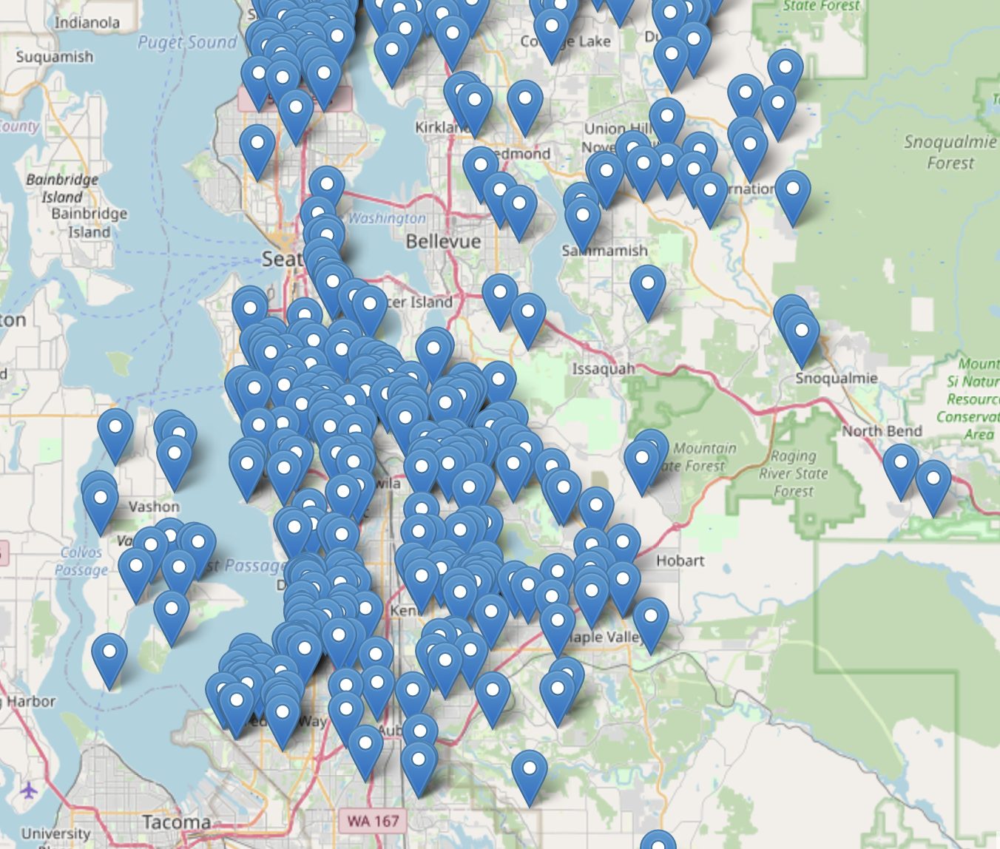

## Final Project Submission

Please fill out:
* Student name: Yeonjae Zhang
* Student pace: full time
* Scheduled project review date/time: April 1st, 2022 Friday
* Instructor name: Praveen Gowtham
* Blog post URL: 


# Overview
Home buyer as family person requested the guide line to buy a house.

# Business Problem
The stakeholder previously bought a house that was overvalued and far from his son’s school. His family was unimpressed.

# Data Understanding
* King County real estate data for homes sold in and around King County,  Washington.
* Middle school locations in King County. We are able to calculate the distances from the houses in King County real estate data.  

### King County House Data

object dtype: Date, waterfront, view, condition, grade, sqft_basement

<div>
<style scoped>
    .dataframe tbody tr th:only-of-type {
        vertical-align: middle;
    }

    .dataframe tbody tr th {
        vertical-align: top;
    }

    .dataframe thead th {
        text-align: right;
    }
</style>
<table border="1" class="dataframe">
  <thead>
    <tr style="text-align: right;">
      <th></th>
      <th>id</th>
      <th>date</th>
      <th>price</th>
      <th>bedrooms</th>
      <th>bathrooms</th>
      <th>sqft_living</th>
      <th>sqft_lot</th>
      <th>floors</th>
      <th>waterfront</th>
      <th>view</th>
      <th>...</th>
      <th>grade</th>
      <th>sqft_above</th>
      <th>sqft_basement</th>
      <th>yr_built</th>
      <th>yr_renovated</th>
      <th>zipcode</th>
      <th>lat</th>
      <th>long</th>
      <th>sqft_living15</th>
      <th>sqft_lot15</th>
    </tr>
  </thead>
  <tbody>
    <tr>
      <th>0</th>
      <td>7129300520</td>
      <td>10/13/2014</td>
      <td>221900.0</td>
      <td>3</td>
      <td>1.00</td>
      <td>1180</td>
      <td>5650</td>
      <td>1.0</td>
      <td>NaN</td>
      <td>NONE</td>
      <td>...</td>
      <td>7 Average</td>
      <td>1180</td>
      <td>0.0</td>
      <td>1955</td>
      <td>0.0</td>
      <td>98178</td>
      <td>47.5112</td>
      <td>-122.257</td>
      <td>1340</td>
      <td>5650</td>
    </tr>
    <tr>
      <th>1</th>
      <td>6414100192</td>
      <td>12/9/2014</td>
      <td>538000.0</td>
      <td>3</td>
      <td>2.25</td>
      <td>2570</td>
      <td>7242</td>
      <td>2.0</td>
      <td>NO</td>
      <td>NONE</td>
      <td>...</td>
      <td>7 Average</td>
      <td>2170</td>
      <td>400.0</td>
      <td>1951</td>
      <td>1991.0</td>
      <td>98125</td>
      <td>47.7210</td>
      <td>-122.319</td>
      <td>1690</td>
      <td>7639</td>
    </tr>
    <tr>
      <th>2</th>
      <td>5631500400</td>
      <td>2/25/2015</td>
      <td>180000.0</td>
      <td>2</td>
      <td>1.00</td>
      <td>770</td>
      <td>10000</td>
      <td>1.0</td>
      <td>NO</td>
      <td>NONE</td>
      <td>...</td>
      <td>6 Low Average</td>
      <td>770</td>
      <td>0.0</td>
      <td>1933</td>
      <td>NaN</td>
      <td>98028</td>
      <td>47.7379</td>
      <td>-122.233</td>
      <td>2720</td>
      <td>8062</td>
    </tr>
    <tr>
      <th>3</th>
      <td>2487200875</td>
      <td>12/9/2014</td>
      <td>604000.0</td>
      <td>4</td>
      <td>3.00</td>
      <td>1960</td>
      <td>5000</td>
      <td>1.0</td>
      <td>NO</td>
      <td>NONE</td>
      <td>...</td>
      <td>7 Average</td>
      <td>1050</td>
      <td>910.0</td>
      <td>1965</td>
      <td>0.0</td>
      <td>98136</td>
      <td>47.5208</td>
      <td>-122.393</td>
      <td>1360</td>
      <td>5000</td>
    </tr>
    <tr>
      <th>4</th>
      <td>1954400510</td>
      <td>2/18/2015</td>
      <td>510000.0</td>
      <td>3</td>
      <td>2.00</td>
      <td>1680</td>
      <td>8080</td>
      <td>1.0</td>
      <td>NO</td>
      <td>NONE</td>
      <td>...</td>
      <td>8 Good</td>
      <td>1680</td>
      <td>0.0</td>
      <td>1987</td>
      <td>0.0</td>
      <td>98074</td>
      <td>47.6168</td>
      <td>-122.045</td>
      <td>1800</td>
      <td>7503</td>
    </tr>
  </tbody>
</table>
<p>5 rows × 21 columns</p>
</div>


### Middle school distance data

<div>
<style scoped>
    .dataframe tbody tr th:only-of-type {
        vertical-align: middle;
    }

    .dataframe tbody tr th {
        vertical-align: top;
    }

    .dataframe thead th {
        text-align: right;
    }
</style>
<table border="1" class="dataframe">
  <thead>
    <tr style="text-align: right;">
      <th></th>
      <th>id</th>
      <th>price</th>
      <th>bedrooms</th>
      <th>bathrooms</th>
      <th>sqft_living</th>
      <th>sqft_lot</th>
      <th>floors</th>
      <th>sqft_above</th>
      <th>yr_built</th>
      <th>yr_renovated</th>
      <th>zipcode</th>
      <th>lat</th>
      <th>long</th>
      <th>sqft_living15</th>
      <th>sqft_lot15</th>
      <th>HubName</th>
      <th>HubDist</th>
    </tr>
  </thead>
  <tbody>
    <tr>
      <th>count</th>
      <td>2.159700e+04</td>
      <td>2.159700e+04</td>
      <td>21597.000000</td>
      <td>21597.000000</td>
      <td>21597.000000</td>
      <td>2.159700e+04</td>
      <td>21597.000000</td>
      <td>21597.000000</td>
      <td>21597.000000</td>
      <td>17755.000000</td>
      <td>21597.000000</td>
      <td>21597.000000</td>
      <td>21597.000000</td>
      <td>21597.000000</td>
      <td>21597.000000</td>
      <td>21597.000000</td>
      <td>21597.000000</td>
    </tr>
    <tr>
      <th>mean</th>
      <td>4.580474e+09</td>
      <td>5.402966e+05</td>
      <td>3.373200</td>
      <td>2.115826</td>
      <td>2080.321850</td>
      <td>1.509941e+04</td>
      <td>1.494096</td>
      <td>1788.596842</td>
      <td>1970.999676</td>
      <td>83.636778</td>
      <td>98077.951845</td>
      <td>47.560093</td>
      <td>-122.213982</td>
      <td>1986.620318</td>
      <td>12758.283512</td>
      <td>6374.645877</td>
      <td>1.264706</td>
    </tr>
    <tr>
      <th>std</th>
      <td>2.876736e+09</td>
      <td>3.673681e+05</td>
      <td>0.926299</td>
      <td>0.768984</td>
      <td>918.106125</td>
      <td>4.141264e+04</td>
      <td>0.539683</td>
      <td>827.759761</td>
      <td>29.375234</td>
      <td>399.946414</td>
      <td>53.513072</td>
      <td>0.138552</td>
      <td>0.140724</td>
      <td>685.230472</td>
      <td>27274.441950</td>
      <td>621.799657</td>
      <td>1.049036</td>
    </tr>
    <tr>
      <th>min</th>
      <td>1.000102e+06</td>
      <td>7.800000e+04</td>
      <td>1.000000</td>
      <td>0.500000</td>
      <td>370.000000</td>
      <td>5.200000e+02</td>
      <td>1.000000</td>
      <td>370.000000</td>
      <td>1900.000000</td>
      <td>0.000000</td>
      <td>98001.000000</td>
      <td>47.155900</td>
      <td>-122.519000</td>
      <td>399.000000</td>
      <td>651.000000</td>
      <td>5103.000000</td>
      <td>0.020115</td>
    </tr>
    <tr>
      <th>25%</th>
      <td>2.123049e+09</td>
      <td>3.220000e+05</td>
      <td>3.000000</td>
      <td>1.750000</td>
      <td>1430.000000</td>
      <td>5.040000e+03</td>
      <td>1.000000</td>
      <td>1190.000000</td>
      <td>1951.000000</td>
      <td>0.000000</td>
      <td>98033.000000</td>
      <td>47.471100</td>
      <td>-122.328000</td>
      <td>1490.000000</td>
      <td>5100.000000</td>
      <td>5893.000000</td>
      <td>0.689758</td>
    </tr>
    <tr>
      <th>50%</th>
      <td>3.904930e+09</td>
      <td>4.500000e+05</td>
      <td>3.000000</td>
      <td>2.250000</td>
      <td>1910.000000</td>
      <td>7.618000e+03</td>
      <td>1.500000</td>
      <td>1560.000000</td>
      <td>1975.000000</td>
      <td>0.000000</td>
      <td>98065.000000</td>
      <td>47.571800</td>
      <td>-122.231000</td>
      <td>1840.000000</td>
      <td>7620.000000</td>
      <td>6399.000000</td>
      <td>1.069560</td>
    </tr>
    <tr>
      <th>75%</th>
      <td>7.308900e+09</td>
      <td>6.450000e+05</td>
      <td>4.000000</td>
      <td>2.500000</td>
      <td>2550.000000</td>
      <td>1.068500e+04</td>
      <td>2.000000</td>
      <td>2210.000000</td>
      <td>1997.000000</td>
      <td>0.000000</td>
      <td>98118.000000</td>
      <td>47.678000</td>
      <td>-122.125000</td>
      <td>2360.000000</td>
      <td>10083.000000</td>
      <td>6827.000000</td>
      <td>1.588646</td>
    </tr>
    <tr>
      <th>max</th>
      <td>9.900000e+09</td>
      <td>7.700000e+06</td>
      <td>33.000000</td>
      <td>8.000000</td>
      <td>13540.000000</td>
      <td>1.651359e+06</td>
      <td>3.500000</td>
      <td>9410.000000</td>
      <td>2015.000000</td>
      <td>2015.000000</td>
      <td>98199.000000</td>
      <td>47.777600</td>
      <td>-121.315000</td>
      <td>6210.000000</td>
      <td>871200.000000</td>
      <td>7592.000000</td>
      <td>24.952758</td>
    </tr>
  </tbody>
</table>
</div>

### Middle School Distance Data

<div>
<style scoped>
    .dataframe tbody tr th:only-of-type {
        vertical-align: middle;
    }

    .dataframe tbody tr th {
        vertical-align: top;
    }

    .dataframe thead th {
        text-align: right;
    }
</style>
<table border="1" class="dataframe">
  <thead>
    <tr style="text-align: right;">
      <th></th>
      <th>id</th>
      <th>date</th>
      <th>price</th>
      <th>bedrooms</th>
      <th>bathrooms</th>
      <th>sqft_living</th>
      <th>sqft_lot</th>
      <th>floors</th>
      <th>waterfront</th>
      <th>view</th>
      <th>...</th>
      <th>sqft_basement</th>
      <th>yr_built</th>
      <th>yr_renovated</th>
      <th>zipcode</th>
      <th>lat</th>
      <th>long</th>
      <th>sqft_living15</th>
      <th>sqft_lot15</th>
      <th>HubName</th>
      <th>HubDist</th>
    </tr>
  </thead>
  <tbody>
    <tr>
      <th>0</th>
      <td>7129300520</td>
      <td>10/13/2014</td>
      <td>221900</td>
      <td>3</td>
      <td>1.00</td>
      <td>1180</td>
      <td>5650</td>
      <td>1.0</td>
      <td>NaN</td>
      <td>NONE</td>
      <td>...</td>
      <td>0.0</td>
      <td>1955</td>
      <td>0.0</td>
      <td>98178</td>
      <td>47.5112</td>
      <td>-122.257</td>
      <td>1340</td>
      <td>5650</td>
      <td>6219</td>
      <td>1.750332</td>
    </tr>
    <tr>
      <th>1</th>
      <td>6414100192</td>
      <td>12/9/2014</td>
      <td>538000</td>
      <td>3</td>
      <td>2.25</td>
      <td>2570</td>
      <td>7242</td>
      <td>2.0</td>
      <td>False</td>
      <td>NONE</td>
      <td>...</td>
      <td>400.0</td>
      <td>1951</td>
      <td>1991.0</td>
      <td>98125</td>
      <td>47.7210</td>
      <td>-122.319</td>
      <td>1690</td>
      <td>7639</td>
      <td>7170</td>
      <td>1.440778</td>
    </tr>
    <tr>
      <th>2</th>
      <td>5631500400</td>
      <td>2/25/2015</td>
      <td>180000</td>
      <td>2</td>
      <td>1.00</td>
      <td>770</td>
      <td>10000</td>
      <td>1.0</td>
      <td>False</td>
      <td>NONE</td>
      <td>...</td>
      <td>0.0</td>
      <td>1933</td>
      <td>NaN</td>
      <td>98028</td>
      <td>47.7379</td>
      <td>-122.233</td>
      <td>2720</td>
      <td>8062</td>
      <td>5516</td>
      <td>1.243018</td>
    </tr>
    <tr>
      <th>3</th>
      <td>2487200875</td>
      <td>12/9/2014</td>
      <td>604000</td>
      <td>4</td>
      <td>3.00</td>
      <td>1960</td>
      <td>5000</td>
      <td>1.0</td>
      <td>False</td>
      <td>NONE</td>
      <td>...</td>
      <td>910.0</td>
      <td>1965</td>
      <td>0.0</td>
      <td>98136</td>
      <td>47.5208</td>
      <td>-122.393</td>
      <td>1360</td>
      <td>5000</td>
      <td>6214</td>
      <td>1.473385</td>
    </tr>
    <tr>
      <th>4</th>
      <td>1954400510</td>
      <td>2/18/2015</td>
      <td>510000</td>
      <td>3</td>
      <td>2.00</td>
      <td>1680</td>
      <td>8080</td>
      <td>1.0</td>
      <td>False</td>
      <td>NONE</td>
      <td>...</td>
      <td>0.0</td>
      <td>1987</td>
      <td>0.0</td>
      <td>98074</td>
      <td>47.6168</td>
      <td>-122.045</td>
      <td>1800</td>
      <td>7503</td>
      <td>5338</td>
      <td>0.687628</td>
    </tr>
  </tbody>
</table>
<p>5 rows × 23 columns</p>
</div>


# Data Preparation
Prepare the data for house price prediction model

### Data Cleaning
I drop NaN, encode categorical variables and find correlated variables with price


# Data Analysis

### Numeric Features
 


### Categorical Features
    

    


# Feature Engineering

### Preprocess Train Data
In train data, i transformed the categorical variables to numeric variables with ordinal encoder.

### Preprocess Test Data
In test data, i transformed the categorical variables to numeric variables with ordinal encoder.

### Find houses near middle school
* Our investor is looking for a property close to a middle school.
* This figure shows the houses split into quarters based on the distance a house is to nearest middle school. 
The closest 25% of houses sold in King County are 0.7 miles away or less from their nearest middle school.
* To guarantee a quick commute time to school, the homebuyer should buy a house that is 0.7 miles away or less from a middle school.

    

    

<div>
<style scoped>
    .dataframe tbody tr th:only-of-type {
        vertical-align: middle;
    }

    .dataframe tbody tr th {
        vertical-align: top;
    }

    .dataframe thead th {
        text-align: right;
    }
</style>
<table border="1" class="dataframe">
  <thead>
    <tr style="text-align: right;">
      <th></th>
      <th>id</th>
      <th>date</th>
      <th>price</th>
      <th>bedrooms</th>
      <th>bathrooms</th>
      <th>sqft_living</th>
      <th>sqft_lot</th>
      <th>floors</th>
      <th>waterfront</th>
      <th>view</th>
      <th>...</th>
      <th>sqft_basement</th>
      <th>yr_built</th>
      <th>yr_renovated</th>
      <th>zipcode</th>
      <th>lat</th>
      <th>long</th>
      <th>sqft_living15</th>
      <th>sqft_lot15</th>
      <th>HubName</th>
      <th>HubDist</th>
    </tr>
  </thead>
  <tbody>
    <tr>
      <th>4</th>
      <td>1954400510</td>
      <td>2/18/2015</td>
      <td>510000</td>
      <td>3</td>
      <td>2.00</td>
      <td>1680</td>
      <td>8080</td>
      <td>1.0</td>
      <td>False</td>
      <td>NONE</td>
      <td>...</td>
      <td>0.0</td>
      <td>1987</td>
      <td>0.0</td>
      <td>98074</td>
      <td>47.6168</td>
      <td>-122.045</td>
      <td>1800</td>
      <td>7503</td>
      <td>5338</td>
      <td>0.687628</td>
    </tr>
    <tr>
      <th>11</th>
      <td>9212900260</td>
      <td>5/27/2014</td>
      <td>468000</td>
      <td>2</td>
      <td>1.00</td>
      <td>1160</td>
      <td>6000</td>
      <td>1.0</td>
      <td>False</td>
      <td>NONE</td>
      <td>...</td>
      <td>300.0</td>
      <td>1942</td>
      <td>0.0</td>
      <td>98115</td>
      <td>47.6900</td>
      <td>-122.292</td>
      <td>1330</td>
      <td>6000</td>
      <td>6260</td>
      <td>0.544642</td>
    </tr>
    <tr>
      <th>13</th>
      <td>6054650070</td>
      <td>10/7/2014</td>
      <td>400000</td>
      <td>3</td>
      <td>1.75</td>
      <td>1370</td>
      <td>9680</td>
      <td>1.0</td>
      <td>False</td>
      <td>NONE</td>
      <td>...</td>
      <td>0.0</td>
      <td>1977</td>
      <td>0.0</td>
      <td>98074</td>
      <td>47.6127</td>
      <td>-122.045</td>
      <td>1370</td>
      <td>10208</td>
      <td>5338</td>
      <td>0.651845</td>
    </tr>
    <tr>
      <th>17</th>
      <td>6865200140</td>
      <td>5/29/2014</td>
      <td>485000</td>
      <td>4</td>
      <td>1.00</td>
      <td>1600</td>
      <td>4300</td>
      <td>1.5</td>
      <td>False</td>
      <td>NONE</td>
      <td>...</td>
      <td>0.0</td>
      <td>1916</td>
      <td>0.0</td>
      <td>98103</td>
      <td>47.6648</td>
      <td>-122.343</td>
      <td>1610</td>
      <td>4300</td>
      <td>5676</td>
      <td>0.559904</td>
    </tr>
    <tr>
      <th>19</th>
      <td>7983200060</td>
      <td>4/24/2015</td>
      <td>230000</td>
      <td>3</td>
      <td>1.00</td>
      <td>1250</td>
      <td>9774</td>
      <td>1.0</td>
      <td>False</td>
      <td>NONE</td>
      <td>...</td>
      <td>0.0</td>
      <td>1969</td>
      <td>0.0</td>
      <td>98003</td>
      <td>47.3343</td>
      <td>-122.306</td>
      <td>1280</td>
      <td>8850</td>
      <td>6399</td>
      <td>0.576901</td>
    </tr>
  </tbody>
</table>
<p>5 rows × 23 columns</p>
</div>


# Modeling and Evaluation

### House Price Prediction Modeling


```python
# Model define
from sklearn.linear_model import LinearRegression
model = LinearRegression()
```


```python
# Evaluation with cross-validation
from sklearn.model_selection import cross_val_score
cross_val_score(model, X_train**2, y_train, cv=5)
```


    array([0.75132775, 0.69063972, 0.64892535, 0.72535465, 0.73110131])


```python
# Evaluation with test set
model.fit(X_train**2, y_train)
model.score(X_test**2, y_test)
```


    0.7150335566493079


### Prediction
* The bar graph represents the models accuracy.
* Real Price: represents the average home price of all homes in our data. 
* Predicted Price: the average home price predicted by our model.
* 71.5% of the data fit our house price prediction model. 

    

    


# Apply to business problem

### MAP1
* This map shows the houses that have actual prices 40% less than the predicted price of our model.
* The model recommends to consider buying these 507 houses from the original list of 21597 houses.




    

    
### MAP2
* This map shows houses priced less than the predicted value and also fall 0.7 miles or less from the nearest middle school.
* These100 houses are our final recommendation for the stakeholder. 


    

    


## Conclusion
* 71.5% of the data fit our house price prediction model. 

* The model was able to recommend 507 houses to purchase after finding homes where the actual price was 40% lower than the predicted price. 

* To mitigate the commute time for the middle school child we found how many of the 507 houses fall within 0.7 miles from the closest middle school. We found a final list of100 houses that lie within 0.7 miles from a middle school!

# Sources
### Jupyter notebook
<https://github.com/MadScientistYeon/phase2_project/blob/main/notebook.ipynb>

### Presentation
<https://github.com/MadScientistYeon/phase2_project/blob/main/submission/presentation.pdf>
